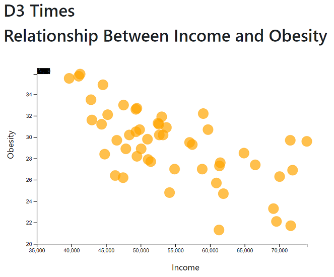

# D3 plot and analysis
D3 simple plot and analysis. The dataset used is based on the American Fact Finder 2014 ACS 1-year estimates (https://factfinder.census.gov/faces/nav/jsf/pages/searchresults.xhtml) from the United States Census Bureau

## Technology
Visual Studio Code, HTML, JavaScript, D3

## Deployment
A local server is required for visualization. For help check
https://github.com/processing/p5.js/wiki/Local-server

## Visualization

